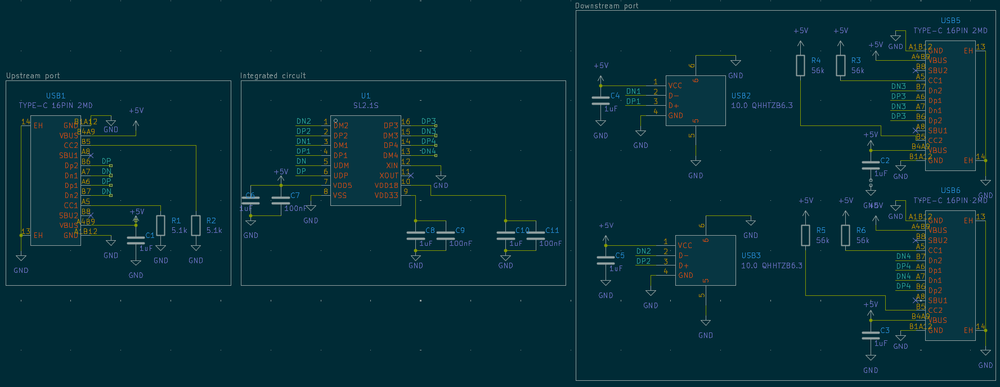
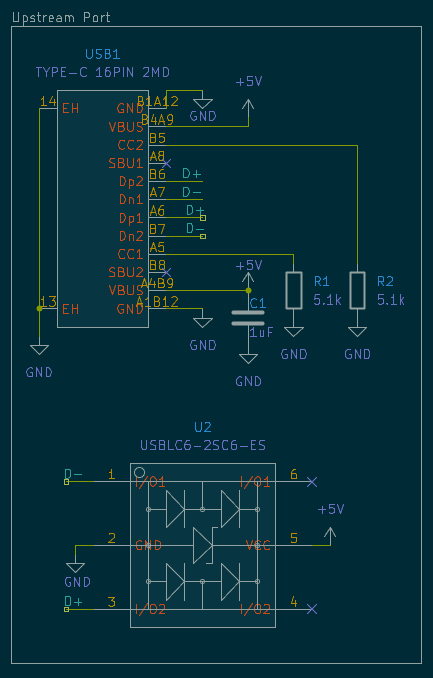
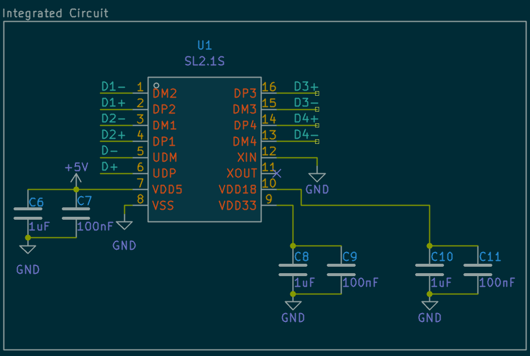
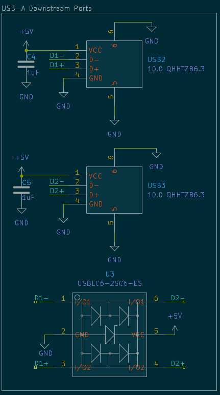
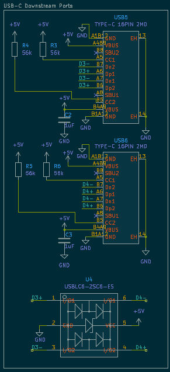
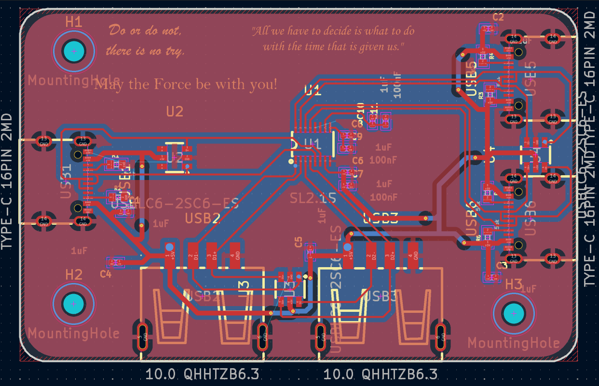
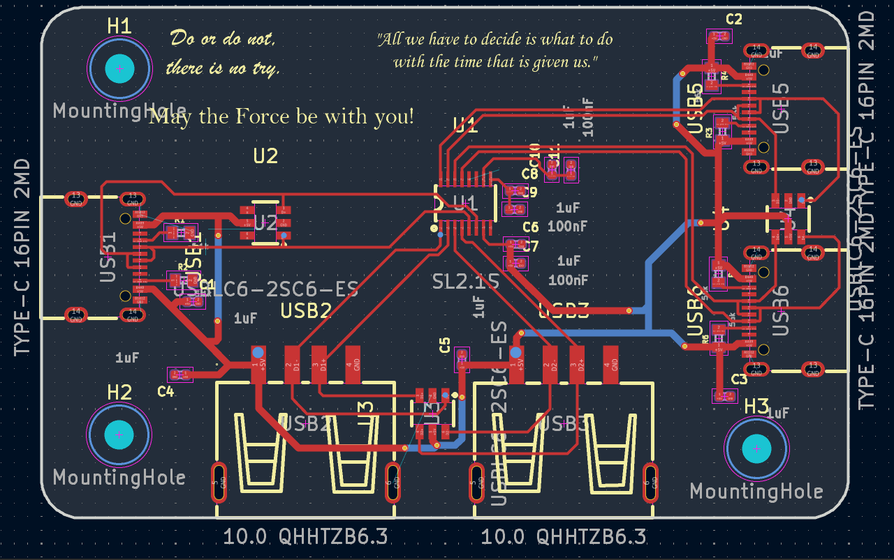
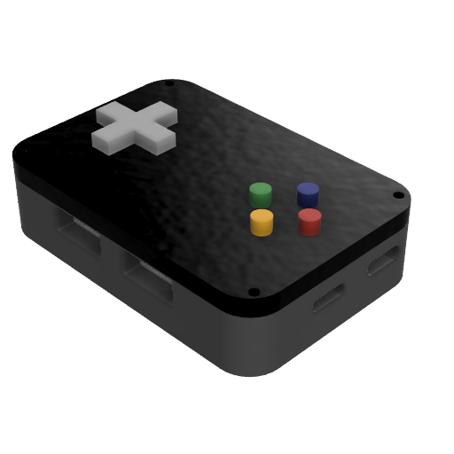
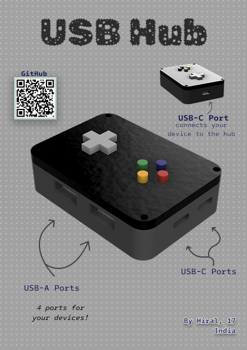

# USB-Hub

This is a USB hub. It has a USB-C port to connect to the device. It has two USB-A ports and two USB-C ports, which can be used for connecting more devices as it allows you to increase the number of ports available.

## Features

- USB-C port to form the connection between the hub and your device.
- 2 USB-A ports
- 2 USB-C ports

## Schematic

This is the schematic for the USB hub. It has an IC, which makes the hub work. 

### Upstream Port

### Integrated Circuit

### Downstream Ports

#### USB-A

#### USB-C

## PCB

Its just a rounded rectangle shaped PCB and has three mounting holes, so it can be screwed into the case.
I added some quotes as silkscreen art.

**No zones**

## Case

I designed this in Fusion, using my PCB as a guide. It has holes for M3 screws so the bottom and top parts hold together. You can find the files in the CAD folder.

## BOM

For a more detailed BOM, take a look at [BOM](bom.csv). It has links to the items and notes.

| Item | Description | Quantity | Unit Price ($) | Total Price ($) |
| --- | --- | --- | --- | --- |
| PCB | PCB | 5 | 1.02 | 5.1 |
| CoreChips SL2.1s | USB 2.0 HUB Controller Integrated Circuit | 5 | 0.2534 | 1.27 |
| SHOU HAN 10.0 QHHTZB6.3 | CONN RCPT USB 2.0 Type-A 4POS SMD R/A | 10 | 0.0636 | 0.64 |
| SHOU HAN TYPE-C 16PIN 2MD(073) | CONN RCPT Type-C 16POS SMD R/A | 20 | 0.0707 | 1.41 |
| ElecSuper USBLC6-2SC6-ES | ESD DIODE 5VWM 15VC SOT-23-6L | 20 | 0.0278 | 0.56 |
| 10k Resistor SMD:R 0402 | Resistor | 6 | 0.0083 | 0.0498 |
| 0.1uf Capacitor SMD:C 0402 | Capacitor | 11 | 0.011 | 0.121 |
| <b>Total</b> | | | | 8.5908 |

## Zine

This was designed in Figma. It wasn't easy to make. I had no ideas. I was stuck. Its not my best work.

## Why did I make it?

I have been trying to get more into hardware, making guided projets before jumping in to make something my own.
I want to have knowledge on how to do this stuff, so I know how to make my own project.
My routing skills were improved. I made them neatly.

This project was submitted to [Fallout](fallout.hackclub.com).